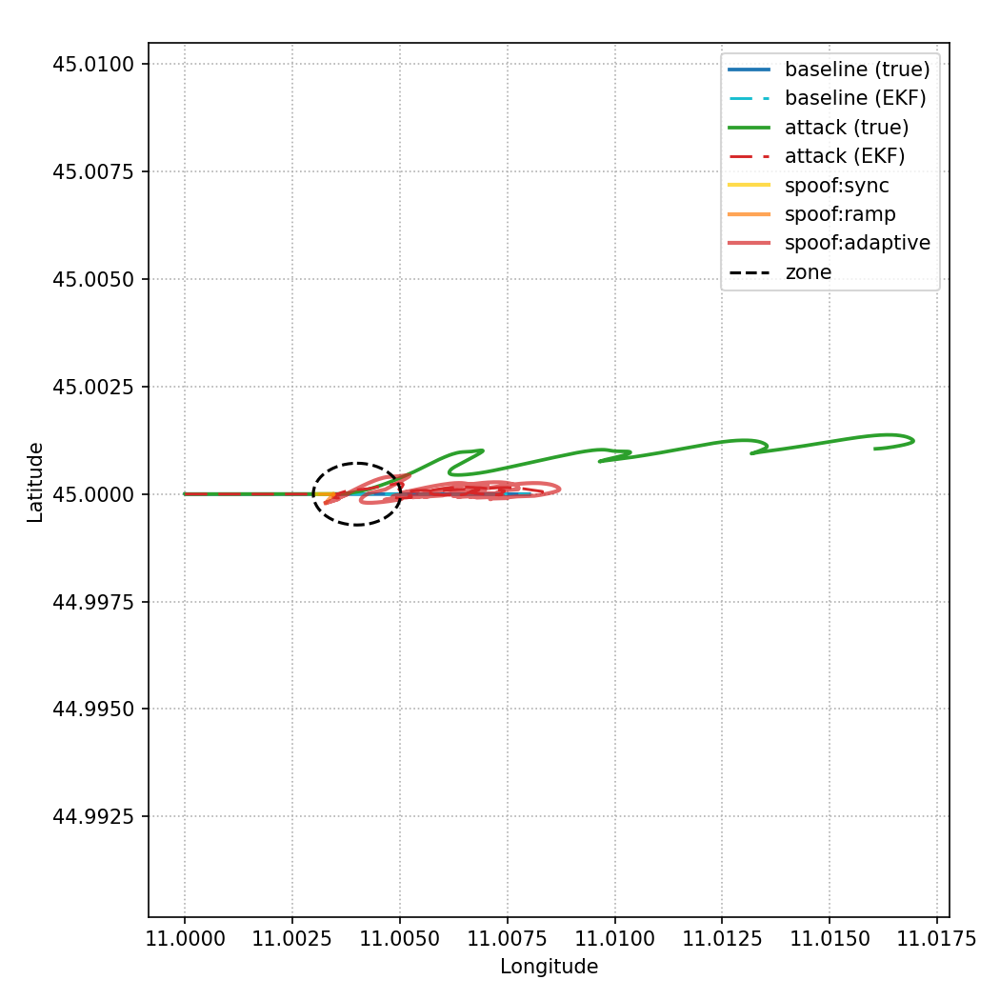

# Tractor Beam Strategy C in ArduCopter SITL

Reproduction of the adaptive GPS spoofing attack from Noh et al., *Tractor Beam:
Safe-hijacking of Consumer Drones with Adaptive GPS Spoofing* (ACM TOPS 22(2), 2019),
against ArduCopter software-in-the-loop. The attacker injects MAVLink `GPS_INPUT`
messages and adapts the fake position each step (`a_t = a_{t-Δ} + (p_t - p_{t-Δ})`,
paper §7.3.2) so that the drone's EKF keeps trusting the spoofed fix while the true
vehicle is steered off its planned track — without tripping the EKF fail-safe.

Report: [`report/report.pdf`](report/report.pdf).

## Result

Single east-bound mission segment, attacker zone mid-track, `a_init` (Eq. 1) chosen
to deflect northward. On the run with ground-truth `SIMSTATE` logging the true
trajectory ends **5.3° off heading** (≈117 m north over ≈1.26 km) while the EKF
estimate stays on the nominal path — inside the 1–9° deflection range the paper
reports in Fig. 13(b).



## Quick start (Docker only)

```bash
./run.sh build          # ArduPilot SITL + Python deps in one image
./run.sh run --zone-circle 45.0000000,11.0040000,80 \
             --target-latlon 45.0006000,11.0040000 \
             --ainit-offset-m 30 \
             --attack-max-runtime-s 90 \
             --profile tractorbeam       # baseline + attack runs -> logs/
./run.sh plot           # trajectory figure from the latest logs
./run.sh sitl           # raw sim_vehicle.py console, if you want to poke at it
```

## Layout

| path | role |
|---|---|
| `scripts/run_scenarios.py` | orchestrates baseline and attack runs, logs, triggers plotting |
| `scripts/auto_mission.py` | uploads the mission, arms, flies, logs EKF and ground-truth GPS |
| `scripts/spoof_gps.py` | the adaptive spoofing state machine and `GPS_INPUT` sender |
| `analysis/plot_path.py`, `plot_extras.py` | trajectory / altitude / velocity figures |
| `missions/attacker_zone_mission.waypoints` | the single-segment mission reproducing the Fig. 13 geometry |
| `missions/sim_float_except_off.parm` | SITL parameter overrides that relax EKF and fail-safe checks |
| `logs/` | CSV logs of the reported runs |
| `report/` | LaTeX source and PDF of the write-up |

**Caveat, stated in the report:** modern ArduPilot EKF3 rejects the spoof by default;
the reproduction depends on the explicit parameter overrides in `missions/`, which the
2019 firmware on the paper's 3DR Solo did not need.
